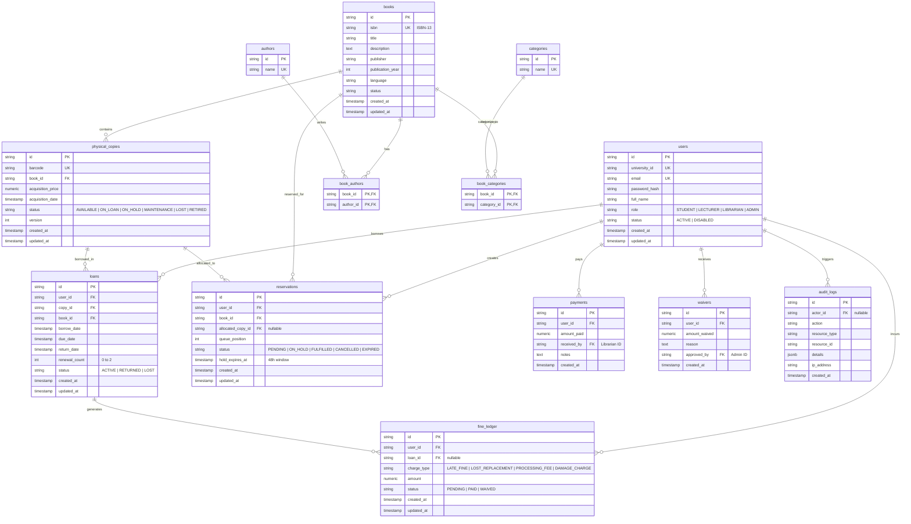

# UniLib Core — Entity-Relationship (ER) Diagram

## Relational Invariants & Constraints

1. **Borrower Domain Parity:** `users.role` stores `STUDENT` or `LECTURER`, yet application logic treats both as `Borrower` with 100% equal rights (max 5 active loans, 14 days duration, max 2 renewals).
2. **Physical Copy Uniqueness:** Each physical copy has an immutable `barcode` and points to a parent `books(id)`.
3. **Pessimistic & Atomic Loan Claim:** A physical copy can have at most one `ACTIVE` loan. When borrowed, `physical_copies.status` transitions atomically to `ON_LOAN`.
4. **FIFO Reservation Allocation:** Books are reserved at the bibliographic record level (`books.id`). When a copy is returned, it is set to `ON_HOLD` for the first borrower in the FIFO queue for 48 hours.
5. **Double-Entry Financial Ledger:** Fines are recorded as individual ledger charge records. Outstanding balance is dynamically computed as:
   $$\text{Outstanding Balance} = \sum \text{Charges} - \sum \text{Payments} - \sum \text{Waivers}$$
   Never allowing negative values.
6. **Immutable Audit Trail:** All critical operations (Borrow, Return, Renew, Confirm Lost, Pay, Waive, Role Update, Status Update) write append-only records to `audit_logs`.
